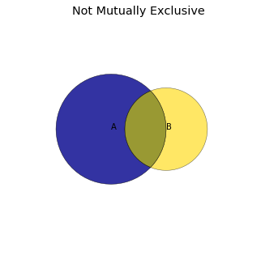

# 五、事件的集合

数据科学中的大多数问题都与多维变量以及事件息息相关。随机变量及其联合分布为我们提供了一种建立数据原始概率模型的方法。当中一些技巧在处理大量变量和事件的集合时非常有用。这些技巧包括：

- 当数据的精确值难以计算时使用临界值
- 在处理小集合时注意所使用的特定模式，将之推广到更大的集合
- 利用对称性可以帮助理解同时简化计算

本章节中我们将会学到关于这些技巧的一些非常有价值的案例。

### 限定并集的几率

在接触更大的事件集合之前，让我们先考虑两个不互斥的事件的并集这种相对简单的情况。下图展示了两个事件，它们的并集是整个着色的区域：蓝色区域，黄色区域，以及它们相交的部分。

通过区域化划分我们能够发现，$A \cup B$的区域范围就是所有$A$涵盖的部分并上$B$中不属于$A$的部分。

$A \cup B = A \cup ( B \setminus AB)$

